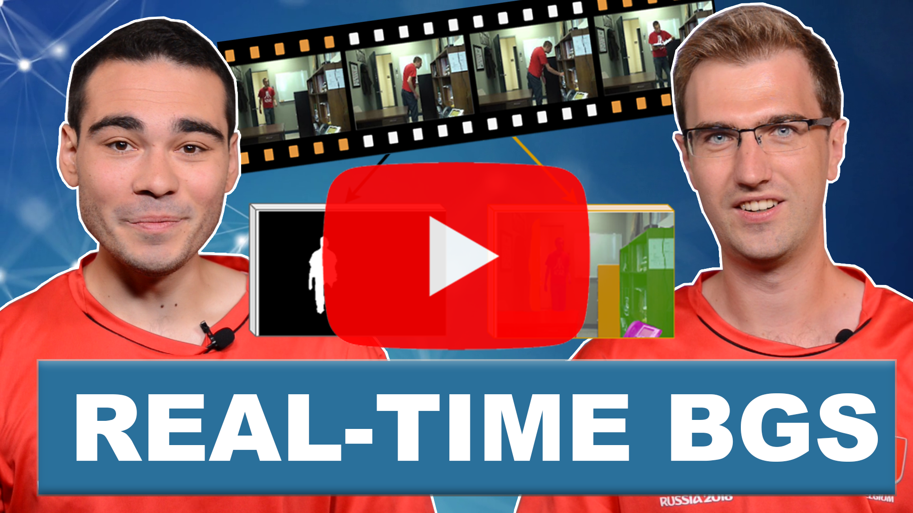

# Real-Time Semantic Background Subtraction

:exclamation: :exclamation: :exclamation: 

Be aware that the code presented in this repository is for research purpose only. 
The technology as well as the ViBe algorithm are PATENT protected, see [LICENSE](LICENSE).
Therefore, this is not a real-time implementation of the method, but simply a benchmarking code to reproduce the results of the scientific paper.
Please contact the [authors](AUTHORS) if you require a commercial license.

Note that we also use the implementation of MedianPool2d from [rwightman](https://gist.github.com/rwightman/f2d3849281624be7c0f11c85c87c1598)

:exclamation: :exclamation: :exclamation:

This repository provides a benchmarking code of the method **RT-SBS**  (Real-Time Semantic Background Subtraction) in Python 3 using the *PyTorch* deep learning framework. This work is presented at the [IEEE Conference on Image Processing](https://2020.ieeeicip.org/) (ICIP 2020).

The paper can be found at the following public addresses: [Paper](https://arxiv.org/abs/2002.04993).

To cite this paper or repository, please use the following bibtex entry:
```bibtex
@InProceedings{Cioppa2020RealTime,
  author = {Cioppa, Anthony and Braham, Marc and Van Droogenbroeck, Marc},
  title = {Real-Time Semantic Background Subtraction},
  booktitle = {The IEEE Conference on Image Processing (ICIP)},
  month = {October},
  year = {2020}
}
```

The objective is to segment all the moving parts of a scene by classifying each pixel into one of the two following classes: the foreground containing the moving objects, and the background for the static parts. To do so, we base our method on the [Semantic background subtraction](https://ieeexplore.ieee.org/document/8297144) method (also called SBS). This a method that combines the decision of two classifiers: Any background subtraction algorithm and a semantic classifier. However this work relies on a pretty strong assumption: that the semantic information is available for each frame of the video. This is not guaranteed in a real-time application. In fact, semantic segmentation is often much slower to compute than background subtraction.

To overcome this issue, we need to find a faster surrogate for the semantic information when it is not available. This is the basics of our algorithm, that we call Real-Time Semantic Background Subtraction (or RT-SBS for short). Our idea is the following: We simply look at the previous available semantic information for each pixel. This gives us some information about the object that was present at that moment. Of course, we cannot completely trust this information as the objects may have moved between the frames. To know whether or not we should trust this previous semantic information, we propose to use a change detection algorithm. This algorithm will indicate whether or not the pixel and its surroundings have significantly changed. In the cases where the pixel has not changed too much, we can still trust the previous semantic information and apply its decision. Otherwise, we do not trust it and rely on the decision of the background subtraction.


<p align="center"></p>

This repository provides every module needed to reproduce the results of the paper on the CDNet 2014 dataset. It also provides the CDNet 2014 data and the [PSPNet](https://arxiv.org/pdf/1612.01105.pdf) semantic segmentation masks so that you don't need to run PSPNet on your device.

For more information about the content of the paper, check out our presentation video. To see more of our work, subscribe to our YouTube channel [__Acad Research__](https://www.youtube.com/channel/UCYkYA7OwnM07Cx78iZ6RHig?sub_confirmation=1)

<a href="https://www.youtube.com/watch?v=CpcvlBohWMw">
<p align="center"></p>
</a>


## Getting Started

The following instructions will help you install the required libraries and the dataset to run the code. The code runs in <code>python 3</code> and was tested inside a nvidia-docker with the folowing base image: <code>pytorch:18.02-py3</code> which can be found at the following address: [NVIDIA TENSORFLOW IMAGE REPOSITORY](https://ngc.nvidia.com/catalog/containers/nvidia:pytorch/tags).


### Prerequisites

Whether you are using the docker image or not, here are the versions of the libraries that are used:

```
numpy==1.14.0
torch==1.0.1.post2
torchvision==0.2.0
tqdm==4.19.4
matplotlib==3.1.2
opencv-python-headless==4.1.2.30
opencv-contrib-python-headless==4.1.2.30
```

### Installing the libraries on docker

If you are using the nvidia-docker, you can follow these steps to instantiate the docker and install the libraries:


In our case we used the following commands to create the dockers. Note that you will need to replace */path/to/your/directory/* by the path to one of your directories and *path/to/the/docker/image* by the path to the docker image. Note that you can select the GPUs to use by changing the index(es) of the *NV_GPU* variable.

```
NV\_GPU=0 nvidia-docker run --name RTSBS -it --rm --shm-size=1g --ulimit memlock=-1 -v /path/to/your/directory/:/workspace/generic path/to/the/docker/image
```

To install the code and libraries, simply run:

```
1. git clone https://github.com/cioppaanthony/rt-sbs
3. cd rt-sbs
3. bash docker_install.sh
```

At this step, all the required libraries are installed. Note that outside of a docker, sudo permission can be required to install the libraries in the <code>docker_install.sh</code> file.


### Installing the libraries with conda

If you are using conda, simply follow these steps to create the environment and install the required libraries:

```
conda create -n context_aware
conda install python=3.7 pip cudnn cudatoolkit=10.1
pip install numpy==1.14.0 torch==1.0.1.post2 torchvision==0.2.0 tqdm==4.19.4 matplotlib==3.1.2 opencv-python-headless==4.1.2.30 opencv-contrib-python-headless==4.1.2.30
```

### Installing the CDNet 2014 Dataset and getting the PSPNet pre-computed masks


For benchmarking, we provide the videos and groud truths of CDNet and the 16-bits segmentation masks of PSPNet. Simply download these masks and unzip all categories folder inside of a specific folder for the CDNet dataset and for PSPNet.

```
pip install -U pip setuptools
pip install gdown

gdown https://drive.google.com/uc?id=1rSpbC70FPpoISZ4X-f4SbfCEPYPPOfWF
unzip Original.zip

gdown https://drive.google.com/uc?id=1T8-2xOsB9HqTJ5SL8JzluoJjAYQ-HEJG
unzip PSPNet_Part1.zip
gdown https://drive.google.com/uc?id=1ghS_nNQ9f733EcW_kln0LYZrseo4_sCf
unzip PSPNet_Part2.zip
```


## Running the code

The code for running RT-SBS on CDNet is located inside the <code>src</code> folder under the name <code>main-rtsbs.py</code>.

Simply go to the <code>src</code> folder and run the following command:

```
python3 main-rtsbs.py -d /path/to/CDNet/Original/ -ds /path/to/PSPNet/
```
The paths should point to the folders containing the different categories (badWeather, baseline,...).

This code will go through all the videos and print the F1 score for each video. Finally, it will print the overall F1 score over the entire dataset.

You can use the different arguments in [utils/argument_parser.py](utils/argument_parser.py) to experiment with the different parameters such as the semantic frame rate and the four thresholds of the method.

If you change the parameters accordingly (see the paper for details), you should get the following points on this graph:

<p align="center"></p>

Otherwise, with the default parameters, the overall F1 score should be around: 0.745


## Authors

See the [AUTHORS](AUTHORS) file for details.


## License

Custom non-permissive.
This work is protected by a patent.

See the [LICENSE](LICENSE) file for details.


## Acknowledgments

* Anthony Cioppa is funded by the FRIA, Belgium.
